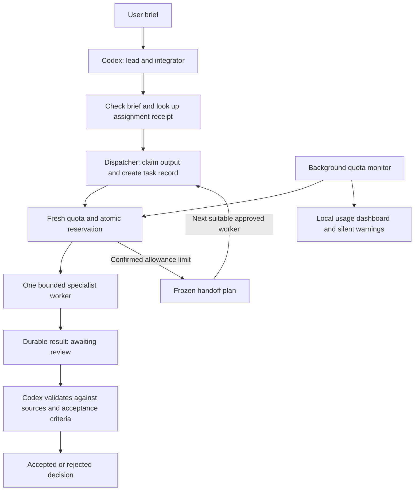

# Application boundaries

`app/paths.py` is the location map. Maintained scripts resolve from this application folder. State lives under `runtime/`; application tasks under `runs/tasks/`; project-level orchestration briefs can also live in the target project's `.orchestration/` folder. Provider account files and SSD model weights are external dependencies, with locations recorded in `config/workers.json`.

The global skill contains workflow guidance and forwarding scripts. It is not a second independent implementation. `scripts/install_global.py` synchronizes the installed skill and registry. Compatibility launchers in the old setup resolve to this application. Historic setup helpers are inert; their original text is archived.

The quota guard serializes state updates, validates editable budgets, rejects duplicate pool identities, ignores older complete provider snapshots, and retains reservations until a post-completion reading is available. Quota checking is admission control, not an ongoing provider-side spend cap.

The dispatcher creates a durable task before admission, claims its requested export path, uses a single approved provider route and records returned model metadata. Supplied-text workers do not own application files. Successful execution awaits independent review. An explicit reviewer decision is evidence of review, not proof that the reviewer is correct.

Workers can author complete modules, tests, documentation and renderable visual
assets as returned artifacts; Codex checks them and applies accepted files. Each
substantial project names external deliverable owners and suitable reviewers,
with Codex responsible for interfaces, integration and final acceptance.

`execution_limits.py` assigns finite deadlines by task size. `worker_execution.py`
drains stdout/stderr and writes `execution-progress.json` and answer-only
`partial-response.txt` in the isolated task workspace. Claude's event summaries
come from `worker_progress.py`; its terminal result remains separate. Missing
Claude terminal results retain uncertain reservations even after a nonzero exit;
an earlier stderr quota retry cannot authorize a handoff. Structured terminal
quota failures use the existing guarded handoff route. Buffered Grok output has
less live detail. No raw thinking event body is written to progress artifacts.

`output_limits.py` bounds pipe chunks, queued events, stream lines, terminal
payloads, buffered stdout, private stderr and retained partial previews. Preview
truncation does not itself reject a complete valid answer. A hard output overflow
raises `WorkerInterrupted` with `output_limit`; the dispatcher preserves uncertain
execution and its reservation. It does not treat overflow as a confirmed quota
rejection or authorize a retry or handoff. Existing finite deadlines still apply.

`brief_check.py` inspects the structure before allowance work. Required mode holds
incomplete briefs; legacy freeform work records feedback without making structure
mandatory. `assignment_receipts.py` writes a durable intent under a project lock
before task creation. Identical keyed requests return the canonical task. An
interrupted claim stays held, and revisions require a known, finalized predecessor.

`task_handoff.py` freezes explicitly selected routes and brief bytes under one
workflow lock. Confirmed quota stops may advance to the next distinct worker;
every step still goes through the dispatcher, receipt store and allowance guard.
Missing/stale readings, unknown completion and permission failures stop the chain.
Local alternatives have an additional small-task capability gate. These are bounded
supplied-text continuations; Codex prepares accepted progress and remaining steps
when a larger task needs a new continuation brief.

`task_inbox.py` creates a standalone read-only snapshot of every canonical task,
including answers, review notes, errors and uncertainty. `task_progress_view.py`
adds dated safe progress, recorded size/deadline, capped incomplete draft previews
and saved handoff ancestry. It reads fixed artifact names under the task/workspace
roots with bounded reads and containment/reparse checks, ignoring arbitrary
artifact paths in JSON. Unverified ancestry remains labeled. Reopening the
launcher refreshes the view; collection never retries, accepts, cancels or repairs.

`task_summary_repair.py` supplies pure stale-index and contribution-audit notices.
Its separate `summary inspect` and `summary repair` commands operate on coherent,
finalized canonical tasks. Explicit repair requires the inspected result hash and
a reviewer note, takes `review.lock`, rechecks source/index identity and versions,
and writes only the TaskStore index projection plus repair evidence. Canonical
result bytes, execution/review decisions, quotas and receipts remain unchanged.
Intent precedes index replacement; success evidence follows verification. An
interrupted evidence write stays visible for inspection, rather than claiming an
atomic multi-file transaction. No repair occurs during inbox generation.

Integration validation for these additions is pending. The user workflow is in
[Task progress and summary repair](task-progress-and-repair.md).

No scheduler daemon assigns tasks itself. Codex chooses tasks and providers. The only persistent background process introduced here monitors quota. Manual provider chat shortcuts operate under the user's direct control and bypass orchestrated task reservations.

Read-only health checks do not validate current login or spend quota. The quota refresh command calls official account interfaces without inference. A real bounded worker task plus independent review validates the dispatch path.
