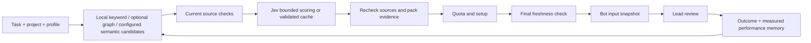

# Brain timing, bot delivery, and linked projects

## When a bot receives memory

1. The coordinator loads its operating guide and project recall at startup. Native Codex workers receive relevant excerpts explicitly in their assignments; independent chats do not query the Brain automatically.
2. Each new hosted assignment validates its task brief, exact run, project, profile and memory policy. Reusing the same saved assignment returns its result without another recall or model call.
3. Recall searches the selected project with FTS5 keywords and aliases. Relationship-oriented queries can expand current graph neighbors; a configured semantic index can find vocabulary gaps. The semantic connector in this installation was unconfigured at the September 26 audit.
4. Current review, validity, source proofs and scope filter candidates. Jev judges this locally found shortlist; it cannot search records it was not given. Implementation/review/research/handoff profiles tailor the judging criteria.
5. The dispatcher fits the chosen evidence to the provider transport, preserving the task and operating guide. After quota/setup, it rechecks the selected memories and original references immediately before dispatch. Changed evidence holds the unsent assignment, with an explicit freshness receipt; it does not launch the worker or repeat Jev automatically.
6. The running task receives an evidence snapshot. New memories do not stream into an already-running bot, and Forget cannot recall a remote request already sent. Task evidence preserves the exact supplied text for audit.
7. A reviewed accepted task normally saves one compact outcome episode, including available timing and usage. One saved episode does not mean only one memory was supplied to the task.

## More memories and more bots

| Task depth | Candidates Jev may score | Memories delivered at most | Character ceiling |
| --- | ---: | ---: | ---: |
| Compact: tiny/small work | 16 | 6 | 8,000 |
| Balanced: medium work | 48 | 12 | 16,000 |
| Deep: large work | 100 | 24 | 32,000 |

Transport and source checks may reduce these counts. These are ceilings; empty space is not filled with unrelated memories. A larger project can improve coverage when it contains relevant, reviewed knowledge. It does not automatically improve speed or answer quality. Precise task queries, useful aliases, typed relationships, source freshness and reviewer feedback matter more than the raw record count.

Independent bot calls overlap. While one waits for recall, another may already be generating. Short local Brain operations use one app-wide file lock, including across projects; that lock is released during model requests. Jev uses at most three simultaneous requests **per lookup**, not across the whole app. Twelve simultaneous lookups could therefore expose up to 36 request slots; this is a theoretical bound, not a production measurement. The team-planner cap is advice, not a global scheduler.

Jev's daily attempted-request guard is shared per app root. Cache hits use no new provider request. Simultaneous identical cache misses currently can duplicate requests; the audit reproduced that offline. Cached decisions still need fresh source checks. Request timeout is a socket timeout, not an absolute deadline for every recall stage.

## What the clocks mean

- **Run elapsed:** calendar time from the run's start to completion or a dated checkpoint.
- **Worker wall time:** creation to finalization, including recall, setup, quota work, model execution and cleanup.
- **Provider execution:** monotonic elapsed duration when measured; legacy timestamp fallback remains explicit.
- **Recall preparation:** the dispatcher phase, which is broader than Brain lookup timing. Jev elapsed covers batch wall time; tokens and charges are summed separately.
- **Summed worker time:** can exceed run elapsed when workers overlap. Two 10-second tasks running together contribute 20 seconds of work in approximately 10 elapsed seconds.
- **Observed overlap:** calculated from recorded completed worker intervals; unknown/native sessions and inconsistent wall-clock intervals are excluded. It is not a speedup measurement.
- **Queue time, tokens and cost:** remain unknown when not reported. Creation-to-start is not automatically queue time, and an artifact import's milliseconds are not native model execution time.

The viewer now shows measured provider/recall totals and recorded peak overlap for the exact run. Hosted execution deadlines begin at provider execution: tiny 120s, small 450s, medium 900s, large 1350s; explicit overrides 30..1800s. Recall/setup occur before those deadlines. A timeout may leave remote execution uncertain even after the local process is stopped.

## Connect memories by dragging

Select a graph node and drag its green **+** handle onto another node. Choose `supports`, `solves`, `depends_on` or `related_to`, then save. The arrow is from the selected node to the target; choose wording accordingly. **Connect memory** provides the same workflow with a keyboard and dropdown. Escape cancels. Normal node dragging, panning, zooming and 3D rotation remain available.

To reuse evidence from another project, open **Connect memory**, choose a different **Connection project**, select an original memory, and enter why it applies. **Reuse and connect memory** explicitly makes that selected content available to the current project's recall and configured providers. It does not authorize access to the rest of the source project.

The destination gets a reviewed reference node with its original project and identity preserved. Ordinary relationships remain within each project's map. The imported node is searchable locally and can be reached through graph expansion; its original evidence is rechecked before recall, export, Jev use and final bot delivery.

References are one hop: select an original, rather than a reference from another project. They are snapshots, not silently updating subscriptions. Original Forget clears dependent copies and indexes; original supersession expires references and notifies destination changefeeds. Expiry or source changes exclude the old reference on the next evidence read. Choose and review the replacement explicitly. Forgetting a destination reference removes that reuse without deleting the original.

The compact map is an exploration view, not a canonical source audit. It exposes only titles, kinds, edges and explicit original locators; full evidence loads separately. Source-file edits do not themselves trigger a live changefeed event, so the map can show a stored reference until refreshed/inspected while recall already excludes it.

## Audit findings and next development priorities

The September 26 baseline inspected 307 records across 26 projects:256 active,43 superseded,8 forgotten. All 277 retained task-source proofs and 22 user-note hashes validated; 256 FTS entries and 86 relationships matched the structural checks. Production scopes contained 113 active memories; experimental scopes remained separate. This proves provenance/integrity at that snapshot, not semantic correctness of every historical claim.

This build fixes stale delivery after quota work, clock-jump execution summaries, oversized Unicode memory indexes, and undercounted source-check diagnostics. It adds reviewed cross-project reuse, draggable connections, and separate overlap/timing summaries. Full memory text remains in canonical task results; compact task indexes keep hashes and metadata.

Highest-value next steps are bounded identical-request sharing across concurrent lookups, measured global Jev scheduling if load warrants it, separate lock/admission-wait telemetry, and an absolute recall latency budget with a clear local fallback. Improve vocabulary coverage with curated aliases or an explicitly configured semantic index, then calibrate ranking and evidence diversity against representative tasks. Keep source support, retrieved/scored/delivered counts and reviewed usefulness separate. None of these remaining optimizations is claimed implemented here, and no whole-task speedup has been established.
