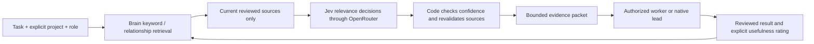

# Jev memory workflow and use-case map

Reviewed against TypeSafe and OpenRouter documentation on **2026-09-25**.
The prioritized capabilities are now implemented. See [operator commands and workflows](jev-workflows.md) for the current interface. Status labels describe available advisory behavior. Upstream demonstrations are
examples, not evidence of improvement on our projects.

## How a bot gets memory



The Brain remains the record of facts, preferences, procedures and reviewed
outcomes. Jev decides which supplied evidence fits a request. The assigned bot
uses that evidence to reason, write or implement. Source hashes, project scope,
approval, expiration, forgetting and permissions stay in ordinary code.
This follows TypeSafe's [decision-model design](https://docs.typesafe.ai/introduction/coding-agents).

For explicitly authorized projects such as agent-orchestrator and openwhispr,
the connector reads OPENROUTER_API_KEY from the configured .env file or process
environment. The app does not copy the key or inject other .env contents into
worker processes.

### Task profiles

Choose a profile for the **job**, independently of which provider performs it.

| Profile | Evidence to favor when relevant to the query |
| --- | --- |
| `general` | Directly applicable facts and current preferences |
| `implementation` | Interfaces, constraints, dependencies and verified fixes |
| `review` | Known failure cases, tests, limitations and rejected approaches |
| `research` | Sources, alternatives, tradeoffs and unresolved questions |
| `handoff` | Decisions, completed work, remaining steps and current constraints |

Project-scoped dispatched assignments already request Brain recall. The task
category selects the profile; `--memory-profile` overrides it. A useful specific
`--memory-query` matters more than a vague label such as "fix bug". The query and
nondefault profile are part of the assignment contract, so changed requirements
cannot silently reuse an older answer. `--no-memory` remains available.

```powershell
python orchestrator.py brain search "retry cancellation limits" --project agent-orchestrator --profile review
python orchestrator.py jev packet "recording never starts recovery" --project openwhispr --profile implementation --recipient codex
```

The packet includes the exact context, IDs, hash, profile and retrieval receipt.
Its status is **prepared only** until an authorized caller actually supplies it.
For native Codex workers, the lead puts the packet and operating guide in the
assignment. An ordinary independent Codex/Claude chat does not automatically read
the Brain just because Jev is configured.

| Bot path | Delivery mechanism | Current limit |
| --- | --- | --- |
| Claude, Grok, guarded Antigravity | Existing dispatcher appends reviewed memory before execution | Provider readiness, task permission and allowance still apply |
| VS Code Copilot worker | Same dispatcher, then the configured VS Code bridge | Requires a selected model and editor consent |
| Native Codex/ASTRA and native workers | Startup recall or explicit `jev packet`, supplied by the lead | Preparing a packet does not prove delivery or use |
| Standalone chats, Grok Bot desktop, NotebookLM | Explicit scoped packet supplied through an authorized workflow | No new automatic background connector implemented |

## Use cases, in priority order

These applications are our design recommendations informed by the linked primary
sources. All listed capabilities are implemented; semantic outputs remain proposals requiring review.

| Use case | Jev decision | State and fallback | Status |
| --- | --- | --- | --- |
| Rank recalled memories | Score each candidate's relevance | Query + reviewed shortlist; preserve order if uncertain | **Enabled** |
| Tailor evidence to the job | Score using task profile | Same scope; role never grants extra access | **Implemented** |
| Prepare consistent context for different bots | Code packages Jev-assisted recall | IDs, source evidence, hash and profile; no delivery claim | **Implemented** |
| Recommend a suitable worker | Choice among permitted workers plus defer | Task + capability descriptions; lead checks permission/readiness | **Advisory CLI** |
| Recover a fact outside the first six hits | Rank a task-sized shortlist, then deliver a bounded packet | Keyword/graph/semantic candidate generation must find it first | **Implemented: up to 100 candidates; 6/12/24 delivered** |
| Separate evidence from conflicting facts | Independent relevance/evidence/conflict judgments | Keep conflicting sources visible; let the reasoning bot resolve them | **Workflow + recall flags** |
| Detect instruction-like text inside evidence | Noul signal for review/quarantine | Deterministic permissions and untrusted-data handling still apply | **Workflow + recall flags**, defense in depth |
| Check whether a proposed memory is supported | Choice: supported / contradicted / insufficient | Candidate claim + source excerpt; human/lead review remains required | **Workflow** |
| Detect duplicate or closely related memories | Pairwise Score or Choice | Preselect pairs locally; propose merge/link, never auto-merge | **Workflow** |
| Suggest graph relationships | Choice from approved relation types plus none | Two sourced memories; explicit relationship review | **Workflow** |
| Decide when more evidence is needed | Separate answer-evidence and sufficiency judgments | Missing/weak evidence triggers bounded retrieval or lead review | **Workflow** |
| Reuse known fixes after a failure | Rank reviewed problem/action/outcome episodes | Error signature and task context; verify code/version applicability | **Workflow** |
| Prioritize stale records for rechecking | Score semantic applicability | Dates/version comparisons computed in code; propose refresh, not deletion | **Workflow** |
| Select relevant skills or procedures | Choice among a short catalogue plus none | Inspect shortlisted skill descriptions; agent still checks applicability | **Workflow** |
| Prepare a handoff after interruption | Rank decisions and remaining-work evidence | Lead/LLM writes the handoff; code preserves ownership and job IDs | **Profile + source-bound workflow** |
| Suggest useful new memories | Score durability and novelty of a reviewed outcome | LLM proposes text; Jev triages; lead approves storage | **Workflow** |
| Flag sensitive content before broader reuse | Noul/Choice advisory classification | Local secret detection and explicit project/provider permissions act first | **Workflow** |
| Verify an answer's citations | Choice for source support | Exact quote/source existence checked in code before semantic judgment | **Workflow** |
| Route routine events without waking a large model | Choice: queue / known handler / ask lead | Only allowed handlers; never change leadership from a model score | **Workflow** |
| Reuse an unchanged decision | No new model call: verified cache | Key by query/profile/model/rubric/content fingerprints; recheck scope and Forget | **Implemented: validated cache** |

The retrieval implementation follows TypeSafe's [reranking](https://docs.typesafe.ai/cookbooks/rerank_typesafe)
and [passage classification](https://docs.typesafe.ai/cookbooks/classifying_rag_passages)
examples. Duplicate/link suggestions adapt [entity alignment](https://docs.typesafe.ai/cookbooks/entity_alignment).
Source support checks adapt [citation verification](https://docs.typesafe.ai/cookbooks/citation_check).
Skill selection follows [progressive skill suggestion](https://docs.typesafe.ai/cookbooks/skill_suggestion).

## Rules for this rollout

- Keep queries specific and state small. Ask one semantic question per judgment.
  Batch related questions when the bounded payload permits it.
- Score relevance separately from source support, conflicts and instruction-like
  content. A single "good memory" score hides different failure modes.
- Keep numeric limits, dates, source hashes, quotas and authorization in code.
  Jev does not generate memory summaries or replace the writing/reasoning model.
- Treat 0.8 as an initial confidence policy, not an established accuracy level.
  Score/Choice confidence summarizes the distribution; Noul is a probability
  without a separate confidence field. Tune on labeled project cases.
- Preserve missing telemetry as unknown. Record actual model versions, requests,
  input/output tokens, returned costs, latency, fallbacks and reviewed usefulness.
- Keep writes/merges/forgetting under current review rules. A high-confidence
  judgment is not permission to alter the memory database or launch a worker.

These choices account for TypeSafe's documented [confidence semantics](https://docs.typesafe.ai/confidence)
and [model limitations](https://docs.typesafe.ai/model-jaggedness/jev-1.13), especially
large irrelevant state, indirection, adversarial inputs and numeric/date precision.

## How we will decide whether it helps

Start with labeled synthetic queries, then reviewer-selected project cases. Keep
the same underlying corpus and candidate list when comparing baseline vs Jev.
Separately measure candidate recall: a scorer cannot recover an absent candidate.

Track relevant-memory coverage, top-result correctness, source-grounded answer
quality, harmful omissions, fallback rate, latency, actual token/cost totals,
and the existing helped/neutral/harmful feedback for accepted worker tasks.
Report coverage separately for implementation, review, research and handoff.
Use production-like normal cases as well as ambiguous, empty, contradictory,
duplicate, instruction-like, forgotten-during-request and changed-source cases.

The initial live checks verified API access and source-preserving fallback. An
Agent-Orchestrator lookup retained its original order because one score was
uncertain; an OpenWhispr lookup produced validated scores; ambiguous worker routing
deferred. These are operational checks, not proof of quality gains or savings.

The six-case synthetic diagnostic is in `benchmarks/jev_memory_cases.json` and
uses the same request builder as production. Its first run exposed ambiguous
numeric candidate references. Questions now identify each memory by its exact
quoted ID. On the corrected run, all six expected memories received the highest
score, but only one case passed the existing all-candidate confidence threshold;
five retained baseline order. The six calls reported $0.00019992 total. These
handcrafted cases deliberately place a distractor first and do not measure normal
search quality or downstream bot benefit. The threshold has not been calibrated.

Validate request construction without a provider call:

```powershell
python benchmarks/jev_memory.py --output runtime/jev-diagnostic-offline.json
```

Add `--live --project agent-orchestrator` for six billable synthetic requests.
Keep the output as a dated evaluation artifact. Use a different filename for each
revision so failed baselines and repairs remain reviewable.

Keep the first deployment reversible. Expand the candidate pool and evaluate
evidence/conflict flags before adding automated curation or decision caching.
See [connection/setup](jev-openrouter.md) for limits and commands.
