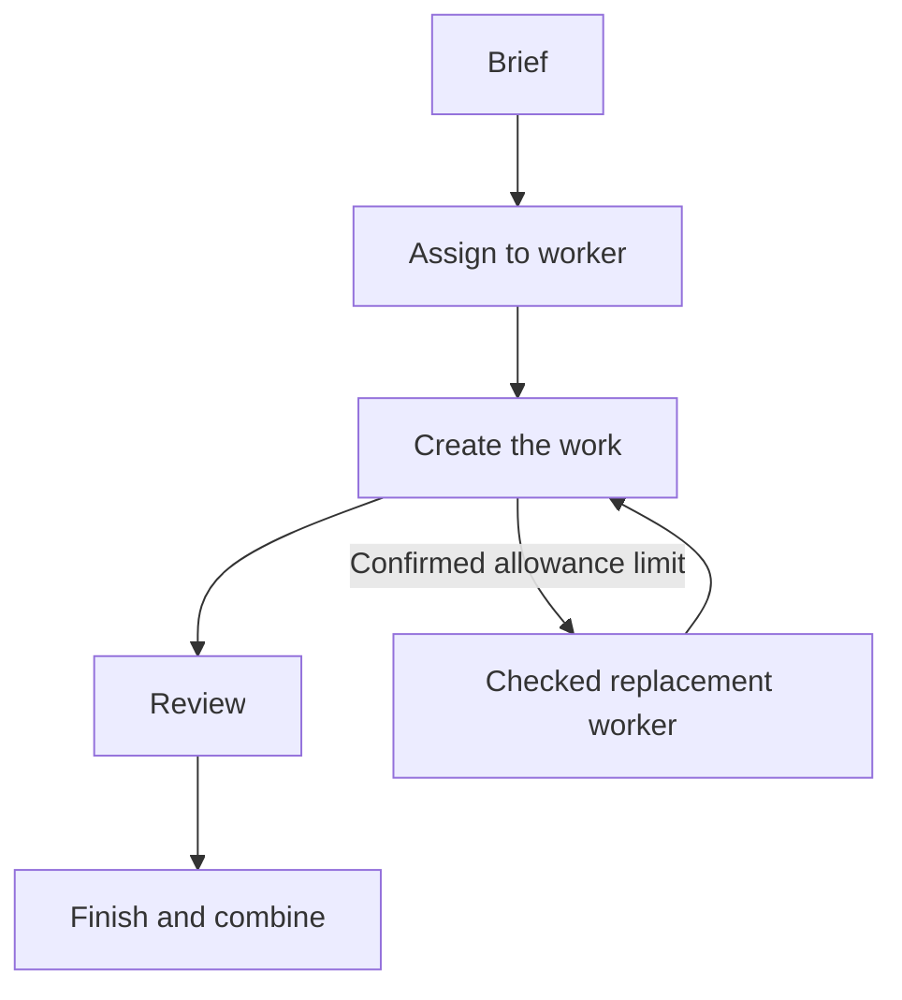

# How a Team of AI Workers Shares a Project

Codex coordinates the project. Ready workers such as Claude or Grok can own code, tests, documentation or presentation pieces. Codex chooses workers that fit the task and are available.

Before a task starts, it passes an allowance check and is given a firm deadline. Another worker may review the result, and Codex then checks and combines whatever is accepted.

If a worker reaches a confirmed allowance limit, the task can move to a suitable back-up worker, who goes through the same allowance check. Available unfinished answer text is saved. If it is unclear whether a task actually ran, it is flagged for inspection rather than repeated.

Work-share percentages are rough estimates of accepted contributions. They are not a bill, and they do not track cost or remaining allowance.

